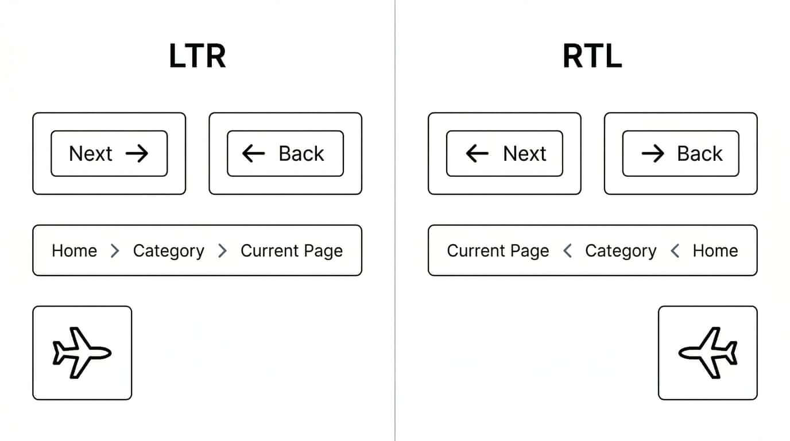

## Question

**What are some best practices for developing user interfaces that support right-to-left (RTL) languages and content?**

When building user interfaces that support both LTR languages (like English) and RTL languages (like Arabic), it is not enough to simply translate the text. The visual balance and flow of the entire application depend on the text direction.

Let's dive into exactly how these layouts relate to each other, what needs directional awareness, and what should remain constant.

### The big picture

The fundamental rule of bidirectional design is aligning the layout with the user's natural scanning pattern. In LTR, the eye starts at the top left and moves right. In RTL, it starts at the top right and moves left. The overarching structure of the page mirrors depending on the script.

If a layout features a navigation sidebar alongside a main content area, the placement depends on the text direction. If the sidebar sits on the start side of the layout, that means the right in RTL and the left in LTR, with the main content expanding in the reading direction.

The starting position of a header also changes: a company logo generally belongs in the "top start" corner, meaning the **top right** for RTL and the **top left** for LTR.

Modern CSS makes this easy. By using CSS Logical Properties, such as `margin-inline-start` instead of `margin-left`, the browser will automatically handle the bidirectional layout for you based on the `dir` attribute of the document.

The following mock layout shows how the overall layout mirror between LTR and RTL interfaces.

<iframe
  src="qa-bidi-ui-data/figure.html"
  title="Mirrored LTR and RTL interface layout"
  loading="lazy"
  style="width: 100%; min-height: 34rem; border: 1px solid #ccc; border-radius: 8px;"
>
  <a href="qa-bidi-ui-data/figure.html">Open the illustration on its own page.</a>
</iframe>

See the <a href="qa-bidi-ui-data/figure.html">standalone illustration</a>.

### Content and forms

Text and structural formatting should adhere to the document's start edges. Paragraphs should be right-aligned in RTL and left-aligned in LTR.

For lists, the bullets or numbers must appear on the start side of the text (right for RTL, left for LTR), with the list naturally indenting in the reading direction.

For forms and inputs, the relative positioning of labels to input fields depends on the text direction. A label sitting next to an input field should be on the **right** side of the field in RTL, and the **left** side in LTR. Checkboxes and radio buttons should be placed at the start of their corresponding text labels (right for RTL, left for LTR).

### Isolation for bidirectional text

User interfaces often combine RTL and LTR strings in the same line, such as an Arabic or Hebrew label followed by an English product name, a menu item containing an English acronym, or a notification that includes a user name. In these cases, you often need [isolation](https://www.w3.org/TR/i18n-glossary/#dfn-bidi-isolation) to prevent bidirectional spillover, where the directionality of one piece of text affects adjacent text or punctuation.

Some inserted strings are especially tricky because they are visually ambiguous: they contain mostly numbers, punctuation, and short abbreviations, so it is not immediately obvious how the parts should group together. A classic "price + price" example is an RTL sentence that needs to display `AED 1,234.56 + USD 12.99`. Without isolation, users may see the currency codes, amounts, or plus sign regrouped in surprising ways, making it unclear which amount belongs to which currency.

In HTML, keep track of the direction of each inserted string and set the `dir` attribute on the element that already wraps it, using `ltr`, `rtl`, or `auto` as appropriate. When neutral characters such as `+`, `-`, or parentheses belong with the inserted text, include them inside the isolated wrapper too. For example, if the whole price expression is one unit, write `<span dir="ltr">AED 1,234.56 + USD 12.99</span>`. Making the direction explicit in the markup helps isolate the embedded text from the surrounding context so that punctuation and neighboring words behave correctly.

In plain text, use the Unicode isolation controls `LRI`, `RLI`, or `FSI`, and close them with `PDI`. These isolate the embedded text so that the surrounding text behaves correctly.

Without isolation, text can be ordered in surprising ways, and punctuation can appear on the wrong side of the inserted text.

### Controls and icons

Directionality in controls is directly tied to the user's mental model of past/future and previous/next. In LTR cultures, "forward" is right, and "backward" is left. In RTL cultures, this is reversed. 

Forward/Next arrows must point to the left in RTL, and to the right in LTR. Back/Previous arrows point right in RTL, and left in LTR.

For breadcrumbs, the flow of navigation follows the text direction. A breadcrumb trail starts with the home page on the far start edge (right for RTL, left for LTR) and progresses towards the current page on the opposite side. When breadcrumb items may contain text with a different direction from the surrounding UI, isolate each item to prevent spillover. That also helps separators behave correctly: for example, a greater-than sign may need to display as an isolated RTL run such as `⁧>⁩`, rather than being reordered unexpectedly by the surrounding text.

Visually, an LTR trail might display as: 

`Home > Category > Current Page` 

while an RTL trail would display as: 

`Current Page < Category < Home`

Any icon that implies motion or direction should match the text direction. Examples include a person running, a chat bubble tail (if it implies the speaker's position), or an airplane taking off towards the layout's "forward" direction.

The following illustration compares control arrows, breadcrumbs, and directional icons in LTR and RTL interfaces.



### Time and sequences

Because of the reading flow, the visual progression of time and sequences must match the text direction. A timeline or Gantt chart must start on the right side of the screen in RTL and the left in LTR. As time advances, the bars and progress indicators grow or move toward the left in RTL, and toward the right in LTR.

Loading bars and sliders should originate on the proper start edge and fill towards the end edge. For instance, if calculating a percentage mapped to an X-coordinate in an SVG progress bar, remember that the origin (x=0), visually represents the beginning of the bar in LTR, but in an RTL context, it represents the end!

<details>
<summary><strong>What NOT to Mirror</strong></summary>

Blindly mirroring every visual element across directional layouts is a common trap. Certain layouts and graphics should remain constant:

* **Logos:** Almost all logos should remain exactly as they are. Unless a company has specifically designed an RTL and LTR version of its logo for localized branding, their orientation does not change.
* **Clocks:** The movement of a clock's hands—clockwise—is a universal concept. Do not mirror circular clocks or refresh icons that are based on clockwise rotation.
* **Non-Directional Icons:** Icons that represent objects rather than actions or flow should not change based on layout direction. A camera, a floppy disk, a magnifying glass, a bell, or a calendar icon should look exactly the same in both layouts.
* **Media Controls:** Standard media playback controls (Play, Pause, Fast Forward, Rewind) generally do not flip. The standard right-pointing triangle for "Play" is ubiquitous globally.

If you are writing a technical article, you will often include code snippets.

```css
/* Code blocks should remain left-aligned regardless of the interface's primary direction. */
.directional-exception {
  text-align: left;
  direction: ltr;
}
```

The vast majority of syntax characters in markup, programming, and database query languages are based on ASCII characters and English keywords. Therefore, the structural flow of code is inherently LTR.
</details>

### Further reading

- [Structural markup and right-to-left text in HTML](https://www.w3.org/International/questions/qa-html-dir)
- [Inline markup and bidirectional text in HTML](https://www.w3.org/International/articles/inline-bidi-markup/)
- Tutorial, [Creating HTML Pages in Arabic, Hebrew and Other Right-to-left Scripts](https://www.w3.org/International/tutorials/bidi-xhtml/)
- Related links, Authoring web pages
  - [Text direction](https://www.w3.org/International/techniques/authoring-html#direction)
  - [Setting up a right-to-left page](https://www.w3.org/International/techniques/authoring-html#using)
  - [Changing the direction of a block element](https://www.w3.org/International/techniques/authoring-html#blocks)
